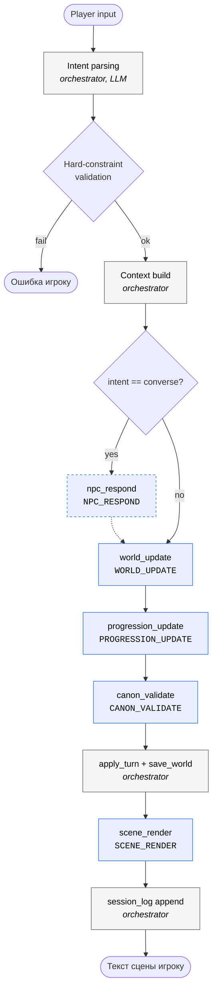
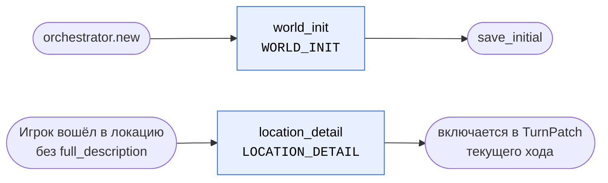

# Архитектура worldsim

## Что это

Текстовая RPG в терминале. Мир генерируется по ходу игры. Канон
(локации, NPC, факты, тайны) хранится на диске как JSON и никогда не
теряется.

Главная идея: **это не генератор текста про мир, а симуляция смысла
через действующие сущности**. LLM не держит состояние — он только
предлагает патчи, которые пишутся в канон.

## Мульти-репо

Система разделена на **7 независимых git-репо**, живущих рядом в
`sandbox/repos/`:

```
worldsim-workspace            ← source of truth: docs, schemas, prompt-framework, sync
worldsim-orchestrator         ← CLI, цикл хода, validators, persistence, intent, settings
worldsim-world-builder        ← мир: генерация + догенерация + обновление состояния
worldsim-canon-keeper         ← консистентность канона
worldsim-scene-master         ← рендер сцены игроку
worldsim-npc-mind             ← мышление конкретного NPC в диалоге
worldsim-personal-progression ← прогрессия игрока
```

**Почему так**, а не монорепо: разные люди (в т.ч. non-coder, работающие
через Claude Code) могут править свой агент без конфликтов с другими.
Общие схемы синкаются из workspace через скрипт.

## Слои ответственности

```
┌───────────────────── Orchestrator ─────────────────────┐
│  CLI (typer) · Intent · Settings · Persistence · Loop  │
│  Hard constraints (Python-валидаторы)                  │
└────────────────┬────────────────────────┬──────────────┘
                 │ вызывает               │ вызывает
                 ▼                        ▼
         ┌────── LLM-агенты ──────────────────────────┐
         │ world-builder, canon-keeper, scene-master, │
         │ npc-mind, personal-progression             │
         └────────────────┬───────────────────────────┘
                          │ пишет патчи
                          ▼
                 ┌─── Канон (JSON на диске) ───┐
                 │ world_meta, locations,       │
                 │ characters, factions,        │
                 │ secrets, arcs, plot_state,   │
                 │ player_progression, timeline │
                 └──────────────────────────────┘
```

## Универсальный цикл

Исходная схема из заметок:

```
восприятие → осмысление → намерение → выбор средства → действие → последствия → новое восприятие
```

Этот цикл работает на двух уровнях:

- **Для игрока** — он видит сцену (восприятие), думает, вводит текст
  (намерение), orchestrator превращает в Intent (выбор средства), резолв
  через агентов (действие), патчи (последствия), новая сцена.
- **Для мира-агента** (world-builder) — он "воспринимает" актуальный
  канон, осмысляет напряжения, формирует план NPC/фракций, принимает
  решения от их лица, пишет последствия в канон.

Детальнее: [loop.md](loop.md).

## Два источника ограничений

**Hard constraints** — детерминированные правила, проверяются Python-кодом
в orchestrator ДО вызова LLM-агентов. Примеры:

- нельзя использовать предмет, которого нет в inventory;
- нельзя переместиться в локацию, не соединённую с текущей;
- нельзя говорить с NPC, которого нет в твоей локации;
- мёртвый NPC не действует;
- NPC не может упомянуть факт, которого нет в его `knowledge`.

**Soft constraints** — числовые поля канона, которые LLM меняет через
патчи: `attitude_to_player`, `reputation[faction]`, `arc.urgency`,
`plot_state.dramatic_pressure`. Здесь работает убеждение, время,
обстоятельства.

Детальнее: [constraints.md](constraints.md).

## Ленивая генерация

Мир создаётся **компактно** в начале: 1 город, 5 районов, 3 фракции,
6-10 ключевых NPC, 3 активные тайны, 2 стартовые арки. При первом
посещении локации `world-builder` догенерирует её `full_description` и
`active_elements`. Это экономит токены и не даёт миру "разбухнуть"
раньше, чем игрок его увидит.

## Персистентность

- Каждый мир — это папка в `repos/worldsim-orchestrator/saves/<world_id>/`.
- Файлы: `world_meta.json`, `locations.json`, `characters.json`,
  `factions.json`, `secrets.json`, `arcs.json`, `plot_state.json`,
  `player_progression.json`, `game_settings.json`, `timeline.jsonl`,
  `session_log.jsonl`.
- Изменения идут **патчами** (`PatchOp`), не полной перезаписью.
- `timeline.jsonl` — append-only лог событий, удобен для отладки и
  будущей механики "воспоминаний".

Детальнее: [canon-model.md](canon-model.md).

## Взаимодействие агентов

DAG цикла хода. Каждая LLM-фаза подписана значением `AgentPhase` из
`agents.toml` — чтобы визуально связать диаграмму с реестром
(см. [ADR 0002](adr/0002-agent-registry.md)).



Пунктирная стрелка от `npc_respond` — фаза опциональна
(`manifest.optional = true`, срабатывает только на `intent == converse`).
Все агент-узлы диспатчатся через `reg.call(phase, ...)` — orchestrator
не знает про конкретные пакеты (см. [ADR 0002](adr/0002-agent-registry.md)),
а агенты не знают друг о друге (см. [ADR 0003](adr/0003-no-inter-agent-bus.md)).

### Off-turn pipeline

Две фазы работают **вне** основного цикла:



- `WORLD_INIT` — одноразовый при создании мира.
- `LOCATION_DETAIL` — ленивая догенерация при первом входе в локацию,
  результат вклеивается в основной turn как PatchOp.

## Архитектурные решения

Все значимые развилки фиксируются как ADR — см. [docs/adr/](adr/README.md).
Перед вопросом "а почему у нас X, а не Y" читаем соответствующий ADR.

## Что НЕ в MVP

- Боёвка
- Фоновая симуляция (мир живёт между ходами)
- plot-weaver как отдельный агент (арки пока ведёт world-builder)
- Мульти-персонаж / партия
- UI кроме терминала
